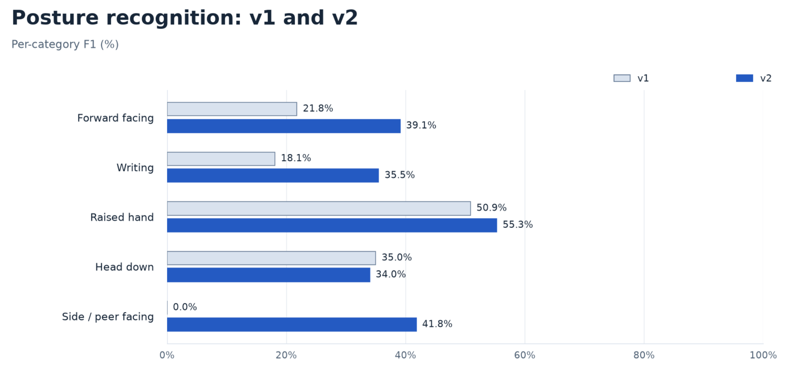

# Classroom Activity Signal Analyzer

Classroom Activity Signal Analyzer is a local Python prototype for analyzing
observable posture and activity signals in classroom photographs and video.
It combines YOLOv8 person detection, MediaPipe Pose landmarks, and geometric
rules, then saves results and generates charts for review.

The project supports classroom analytics experiments, teaching demonstrations,
and research prototypes where image processing should stay on the local machine.

We have a lots of updates in version 2. Please check the "/Classroom-Activity-Signal-Analyzer - Version 2" directory! 

## Data Use Declaration

The application does not identify students or build persistent participant
profiles. Observation numbers belong to a single photo; temporary tracks in
continuous analysis are local to a session. Optional seat IDs describe image
locations, not personal identities.

Results include aggregate summaries and per-detection evidence. JSON and CSV
files contain source paths, and optional annotated images preserve the input
content, so generated outputs should be reviewed before sharing.

## Responsible Use

This prototype describes visible posture, not attention, learning, emotion,
motivation, or intent. It should not be used for grading, attendance decisions,
disciplinary action, psychological assessment, admissions, or other individual
student evaluations. Obtain informed consent before collecting classroom images
or video, and follow applicable school policies for access, storage, and deletion.

## Features

- Single-photo, photo-folder, webcam, video-file, and RTSP input.
- Folder monitoring for new or updated photographs.
- YOLOv8 person detection and MediaPipe Pose estimation.
- Five observable posture categories, with an explicit unknown state.
- Independent snapshot analysis and optional temporal confirmation.
- Configurable posture rules and optional seat regions or expected headcounts.
- Local JSON and CSV results, automatic charts, and optional annotated images.

## How It Works

The detector locates people, and a pose estimator extracts landmarks from each
person crop. Geometric rules use visible head, shoulder, elbow, and wrist
positions to assign a posture or return unknown. Results are saved per sample
and summarized across the run.

Snapshots are analyzed independently. For continuous sources, temporal mode
adds temporary IoU tracking and optional confirmation delays.

## Observable Signal Rules

| Output                   | Interpretation                                                        |
| ------------------------ | --------------------------------------------------------------------- |
| `forward_facing_posture` | Visible head geometry is consistent with facing forward.              |
| `writing_posture`        | Head and arm geometry are consistent with a writing posture.          |
| `raised_hand`            | A visible wrist is sufficiently above its corresponding shoulder.     |
| `head_down_posture`      | The nose is low relative to the visible shoulders.                    |
| `side_facing_posture`    | Head geometry suggests side or peer facing.                           |
| `unknown`                | Evidence is missing, unreliable, ambiguous, or awaiting confirmation. |

Distances are normalized by visible shoulder width. The classification priority
is raised hand, side facing, writing, head down, then forward facing. Thresholds
can be adjusted with `--rules-config`; see the [usage guide](docs/USAGE.md).

The drawings are conceptual illustrations, not detector output or training data.
A still image cannot establish writing motion, a conversation, or how long a
posture lasted. Unknown is an evidence state, not a sixth posture.

## Installation

Use **Python 3.11** and install the dependencies in a virtual environment:

```bash
python -m venv .venv
```

On Windows:

```powershell
.\.venv\Scripts\Activate.ps1
python -m pip install -r requirements.txt
```

On Linux or macOS:

```bash
source .venv/bin/activate
python -m pip install -r requirements.txt
```

The default model is `yolov8n.pt`; Ultralytics may download it on first use.
For offline processing, install the dependencies and obtain the model beforehand,
then select its local path with `--yolo-model`. The MediaPipe version range in
`requirements.txt` preserves compatibility with its legacy Pose API.

## Usage

Analyze a photograph and optionally save an annotated image:

```bash
python main.py --image-path "photos/classroom.jpg" --output-json "output/photo.json" --annotated-dir "output/annotated"
```

Process a photo folder, or monitor it for incoming files:

```bash
python main.py --images-dir "photos" --output-json "output/batch.json"
python main.py --images-dir "incoming" --watch --poll-interval 2
```

Analyze a webcam, video file, or RTSP stream:

```bash
python main.py --source camera --camera-id 0 --display
python main.py --video-path "classroom.mp4" --interval 5
python main.py --source rtsp --rtsp-url "rtsp://camera.example/stream"
```

Enable temporal confirmation for continuous video:

```bash
python main.py --video-path "classroom.mp4" --analysis-mode temporal --interval 1
```

Input paths and the stream address above are placeholders. Photo folders use
natural filename order; add `--recursive` to include subfolders. Supported
formats include JPG, JPEG, PNG, BMP, TIFF, and WebP. Keep generated outputs outside
input folders. Preview is off unless `--display` is supplied.

## CLI Options

| Option                          | Default                         | Description                                                            |
| ------------------------------- | ------------------------------- | ---------------------------------------------------------------------- |
| `--source`                      | Inferred from the supplied path | `image`, `images`, `camera`, `video`, or `rtsp`; an input is required. |
| `--image-path` / `--images-dir` | Unset                           | Single photo or photo folder.                                          |
| `--video-path` / `--rtsp-url`   | Unset                           | Video file or stream address.                                          |
| `--camera-id`                   | `0`                             | Camera device ID.                                                      |
| `--analysis-mode`               | `snapshot`                      | Independent samples or `temporal` analysis of continuous sources.      |
| `--interval`                    | `5.0`                           | Seconds between video or stream samples; does not skip photos.         |
| `--confidence`                  | `0.25`                          | Person-detection confidence threshold.                                 |
| `--imgsz`                       | `1280`                          | Detector input size.                                                   |
| `--yolo-model`                  | `yolov8n.pt`                    | Detector model path.                                                   |
| `--output-json`                 | `output/results.json`           | JSON destination; CSV is saved alongside it.                           |
| `--annotated-dir`               | Unset                           | Optional directory for annotated images.                               |
| `--display`                     | Off                             | Open the preview window.                                               |
| `--no-charts`                   | Off                             | Skip chart generation.                                                 |

## Outputs

| File                              | Contents                                                                |
| --------------------------------- | ----------------------------------------------------------------------- |
| `output/results.json`             | Run metadata, aggregate summaries, samples, and per-detection evidence. |
| `output/results.csv`              | Tabular observations and failure or unassigned records.                 |
| `output/results_charts/`          | Posture distribution and detection/evidence coverage charts.            |
| User-selected annotated directory | Image overlays, only when requested.                                    |

JSON checkpoints are saved after each sample. Empty images and failed inputs
remain in the results. Counts across images represent person observations,
not unique people. Detector confidence and landmark visibility are not calibrated
probabilities of a correct posture classification.

Regenerate charts from a saved result:

```bash
python visualization.py --input-json "output/results.json"
```

## Evaluation Results

These anonymous aggregates compare the v1 and v2 on the same private
evaluation set, which consists of 500 samples collected from 10 volunteers.

| Metric                                            | v1    | v2        |
| ------------------------------------------------- | -----:| ---------:|
| End-to-end accuracy, higher is better             | 31.6% | **34.2%** |
| Macro F1, higher is better                        | 25.1% | **41.1%** |
| Matched detection coverage                        | 96.2% | 95.6%     |
| Extra detections per image, lower is better       | 4.14  | **0.88**  |
| Person-count mean absolute error, lower is better | 3.76  | **0.84**  |



The comparison shows higher macro F1 and fewer extra detections for v2, while
overall accuracy remains low. Its unknown rate must be considered alongside
classification performance; v1's zero unknown rate reflects its fallback behavior.

Accuracy counts missed and unknown reference observations as errors. F1 also
penalizes extra detections. Each version uses its own detector defaults, so this
compares complete pipelines rather than isolating algorithm changes.
Reference-label quality was not exhaustively re-adjudicated; these are
exploratory agreement measurements, not a general performance guarantee.

## v2 Release Notes

- **Algorithm:** posture rules now use shoulder-normalized geometry and
  landmark-visibility checks. Writing combines head and arm evidence; side facing
  requires supporting facial geometry. Seven labels are consolidated into five,
  with unknown for insufficient evidence. Face-mesh gaze heuristics and activity
  scores are removed; snapshots are independent, with temporal confirmation
  available for continuous sources.
- **Other changes:** photo input and folder monitoring, configurable thresholds,
  optional seat regions, per-detection JSON/CSV, annotated images, and explicit
  records for empty or failed inputs.

Detailed changes and output-schema migration notes are in CHANGELOG.txt.

## Limitations

- Occlusion, small people, lighting, camera angle, and crowded scenes can cause
  incorrect labels, missed detections, or unknown results.
- Simple IoU tracking can lose correspondence when people overlap or move.
  Seat regions are tied to a camera view and do not identify occupants.
- Posture rules are heuristics, not validated measures of attention or learning.
  Long-running streams can produce large result files.

## Project Structure

```text
.
|-- main.py                 # CLI and processing loop
|-- sources.py              # Photos, folder monitoring, and capture inputs
|-- tracker.py              # Person detection and optional spatial tracking
|-- analyzer.py             # Pose evidence extraction
|-- behavior.py             # Posture rules and temporal state
|-- seating.py              # Optional location assignment
|-- result_writer.py        # JSON and CSV output
|-- visualization.py        # Result charts
|-- evaluate.py             # Optional comparison with supplied seat labels
|-- requirements.txt
`-- LICENSE
```

## Roadmap Ideas

- Improve tracking robustness in crowded scenes.
- Add a small dashboard for reviewing saved results.
- Improve storage and review workflows for long-running streams.

## Contributing

Issues and pull requests are welcome, especially improvements to documentation,
test coverage, tracking, posture evidence handling, and long-running analysis.

## License

Project source code is available under the [MIT License](LICENSE). Third-party
packages and model weights retain their respective licenses. Model weights are
not included in this repository.
